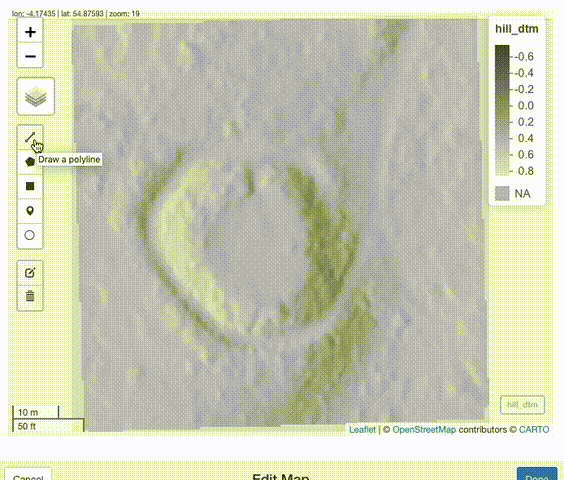

<style>
div.blue { background-color:#D3D3D3; border-radius: 5px; padding: 20px;}
</style>
<div class = "blue">
In this short tutrial I am scripting a  workflow for working with LiDAR data downloaded from  [Scottish Remote Sensing Portal](https://remotesensingdata.gov.scot/). The aim is to process the raw LAZ files, produce  visualizations and take simple measurments solely relaying on R programming language. 
I am looking at  a 12th century motte in Cally Forrest, Galloway, in south-west Scotland.
This mound was actually surveyed by Rubicon Heritage in 2012 [ clik here to read about the fieldwork](http://www.rubiconheritage.com/2012/10/10/cally-forest-motte-survey-a-lovely-shady-lump/).
Now lets see how it compares with work of an <i>armchair archaeologist</i>
</div>


```{r setup, include=FALSE}
knitr::opts_chunk$set(echo = TRUE)
```

## Packages
First, I am loading all packages necessary for the following analysis.
```{r packages, echo=TRUE, message=FALSE, warning=FALSE, paged.print=FALSE}
library(lidR) # process LAZ files
library(raster)# deal with raster
library(rayshader) # 3D viz
library(rgl) # interactive plot
library(sf) # spatial class
library(mapedit) # interactive map editing
library(mapview) # interactive map viewing
library(tmap) # cartography
library(tmaptools) # little helpers
library(smoothr) # smooth contours
library(dplyr) # manipulate
library(ggplot2) # plot
library(grid) # combines plots

```

## LAZ
Next, I am reading the LAZ files and clipping the point cloud to the extent of immidiate area around the motte.
```{r las}
#read laz files
las = readLAS("data/NX6055_4PPM_LAS_PHASE3.laz")

# read a shapefile of area around the motte
motte_area = st_read("data/motte_area.shp", quiet = TRUE)

#clip the laz file to the extend of aoi
motte = lasclip(las, motte_area)

#plot lidar point cloud
plot(motte, bg = "white")

rglwidget()


```

<p style="text-align: center;">grab and rotate the model ! </a></p>

## Digital Elevetion Model

### DTM and DSM

In this step I am running standard alghoritms from LiDR package to compute Digital Surface Model (DSM) and Digitial Terrain Model (DTM).
```{r}
rgl.clear()
# create dsm and dtm
dsm = grid_canopy(motte, 0.5, pitfree())

# assign coordinate system
crs(dsm) = CRS("+init=epsg:27700")

# create dtm
dtm = grid_terrain(motte, 0.5, algorithm = knnidw(k = 6L, p = 2))

# addign coordinate system
crs(dtm) = CRS("+init=epsg:27700")

par(mfrow = c(1,2))
plot(dtm, main = "DTM", col = height.colors(50), legend = FALSE)
plot(dsm, main = "DSM",col = height.colors(50))

```

### Hillshade

There are dozens of alghoritms to visualize or extract characteristics from Digital Elevations Models. The most common is hillshade determined by the aspects and slope of the terrain as well as light source.
```{r echo=TRUE, message=FALSE, warning=FALSE, paged.print=FALSE}

# dsm
slope_dsm = terrain(dsm, opt = 'slope')
aspect_dsm = terrain(dsm, opt = 'aspect')
hill_dsm = hillShade(slope_dsm, aspect_dsm, angle = 40, direction = 270)

# dtm
slope_dtm = terrain(dtm, opt = 'slope')
aspect_dtm = terrain(dtm, opt = 'aspect')
hill_dtm = hillShade(slope_dtm, aspect_dtm, angle = 5, direction = 270)

#plot
par(mfrow = c(1,2))
plot(hill_dtm, main = "DTM Hilshade", col = grey.colors(100, start = 0, end = 1), 
     legend = FALSE)
plot(hill_dsm, main = "DSM Hillshade", col = grey.colors(100, start = 0, end = 1))


```


## Transect
In order to represent the height values and get idea about the profile I will draw a line across the *motte*.

### Line

Package *mapedit* allows  to interactively  draw the line and save it as sf object.

```{r message=FALSE, warning=FALSE, paged.print=FALSE}
mapviewOptions(raster.palette = grey.colors)

interactive_map <- mapview(hill_dtm) %>%
  editMap()

transect.sf = interactive_map$finished

```


```{r, echo=FALSE, out.width= 400, fig.cap="", fig.align='center'}

```


### Elevation

In the following code I use the line selector to extract the z-values from the raster. I need to give credit for the idea to the  book [Geocomputation with R](https://geocompr.robinlovelace.net/geometric-operations.html). Although I had to amend the code to work in projected coordinate system.

```{r message=FALSE, warning=FALSE, paged.print=FALSE}

transect = raster::extract(dtm, transect.sf, along = TRUE, cellnumbers = TRUE)
transect_df = purrr::map_dfr(transect, as_data_frame, .id = "ID")
transect_coords = xyFromCell(dtm, transect_df$cell)
pair_dist = pointDistance(transect_coords,lag(transect_coords), lonlat=FALSE)
transect_df$dist = c(0, cumsum(na.omit(pair_dist))) 
```

### Transect Plot

Now I can plot the data frame with heights along the transect line. The tip is to use fixed *aspect ratio* in order to preserve physical representation of the data units on the axes.

```{r}
profile = ggplot(transect_df) +
  geom_area(aes(x = dist, y = Z),  alpha=0.6 , size=1, colour="#AF002A", fill = "#AF002A") +
  scale_y_continuous(breaks = seq(40, 50, by = 5)) +
  scale_x_continuous(breaks = seq(0, 100, by = 10)) +
  coord_fixed(ylim = c(40,50)) +
  labs(title = "Profile",
       x = "Distance (m)",
       y = "Elevation (m)") +
  theme_bw() +
  theme(panel.grid.minor = element_blank(),
        panel.grid.major.x = element_blank(),
        panel.border = element_blank())
profile

```

## Map

 Lets create a topographic map of the *motte* and plot the location of the transect.

```{r}
#load canomre area
topo_contour <- rasterToContour(dtm, nlevels = 10) %>% 
  st_as_sf() %>% 
  st_cast("LINESTRING") %>% 
  drop_crumbs(20)

# color palette
brewer_grey = get_brewer_pal("Greys", n = 10, contrast = c(0.22, 0.82), plot = FALSE)

map = tm_shape(dtm, unit = "m") +
  tm_raster(style= "pretty", n = 10, palette = brewer_grey, legend.show=F, alpha = 0.75) +
tm_shape(topo_contour) +
  tm_lines(col = "level",
           palette = "Greys",
           legend.col.show = F) +
  tm_text(text = "level",
          size = .5,
          col = "level",
          palette = "-Greys",
          along.lines = F, 
          overwrite.lines = T,
          legend.col.show = F) +
tm_shape(transect.sf) +
  tm_lines(col = "#AF002A",
           lty = "dashed",
           lwd = 2) +
tm_compass(position = c("left", "bottom")) +
tm_scale_bar(breaks = c(0,5,10),
             position = c("left", "bottom")) +
tm_credits("@topographos2") +
tm_layout(
    main.title = "Cally Forrest Motte",
    frame = F)

map

```

## Final Graphic

Finally, I can combine the two graphics.

```{r}
# plot using grid
library(grid)

grid.newpage()
# set up the layout
pushViewport(viewport(layout=grid.layout(1,2)))
# plot using the print command
print(map, vp=viewport(layout.pos.col = 1, height  = 20))
print(profile, vp=viewport(layout.pos.col = 2, height = 20))

```

## Going 3D

And a *cherry on the top* by amazing *rayshader* package

```{r}

#And convert it to a matrix:
elmat = raster_to_matrix(dtm)

elmat %>%
  sphere_shade(texture = "imhof1") %>%
  add_shadow(ray_shade(elmat, zscale = 0.5, sunaltitude = 30,lambert = TRUE),
             max_darken = 1) %>%
  add_shadow(lamb_shade(elmat,zscale = 0.5,sunaltitude = 30), max_darken = 0.2) %>%
  add_shadow(ambient_shade(elmat, zscale = 0.5), max_darken = 0.2) %>%
  plot_3d(elmat, zscale = 0.5,windowsize = c(1000,1000),
          phi = 40, theta = 180, zoom = 0.8, fov = 1)
rglwidget()
```

<p style="text-align: center;">grab and rotate the model ! </a></p>

```{r}
sessionInfo()
```


&nbsp;
<hr />
<p style="text-align: center;">A work by <a href="https://github.com/topographos/">Michal Michalski</a></p>
<p style="text-align: center;"><span style="color: #808080;"><em>michal.m.michalski@durham.ac.uk</em></span></p>

<!-- Add icon library -->
<link rel="stylesheet" href="https://cdnjs.cloudflare.com/ajax/libs/font-awesome/4.7.0/css/font-awesome.min.css">

<!-- Add font awesome icons -->
<p style="text-align: center;">
    <a href="https://twitter.com/topographos2" class="fa fa-twitter"></a>
    <a href="https://topographos.rbind.io/" class="fa fa-globe"></a>
    <a href="https://github.com/topographos/" class="fa fa-github"></a>
</p>

&nbsp;
